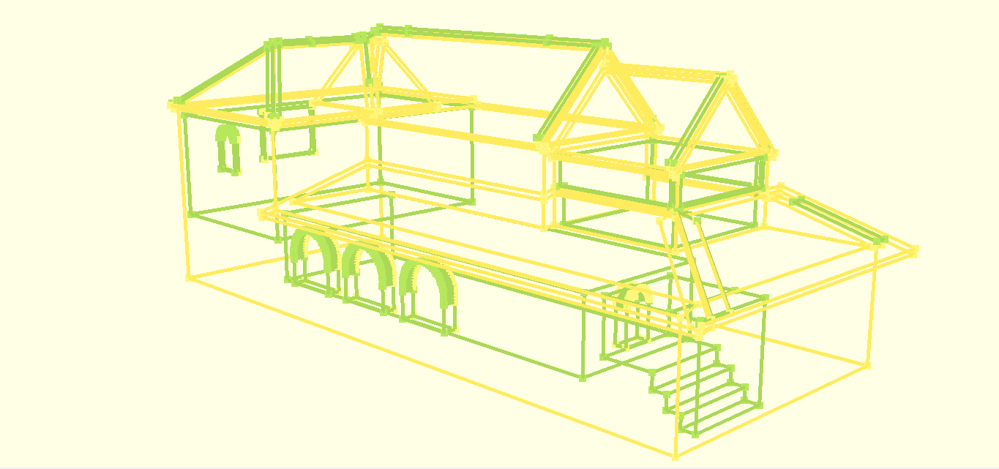
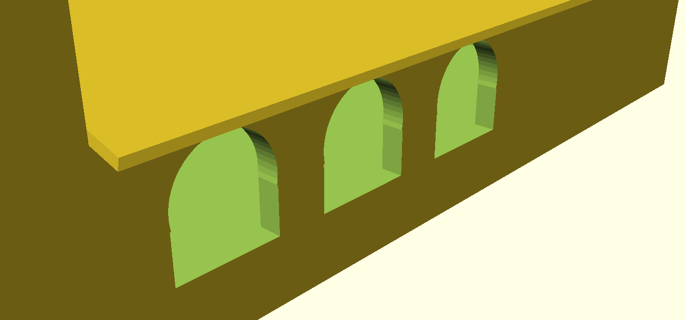
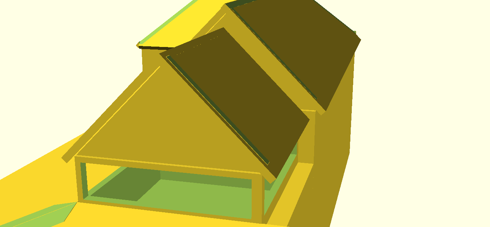
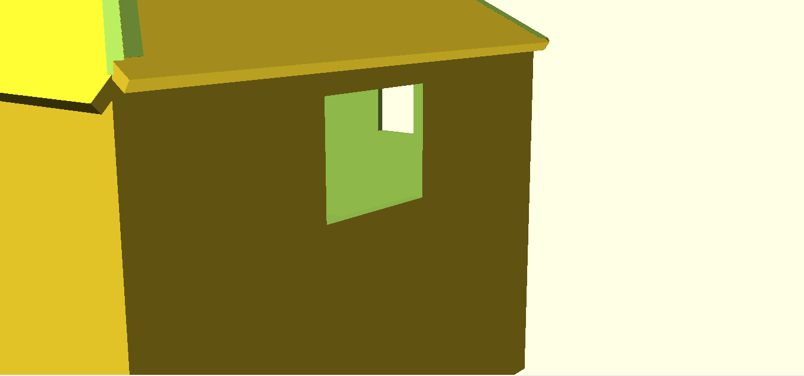
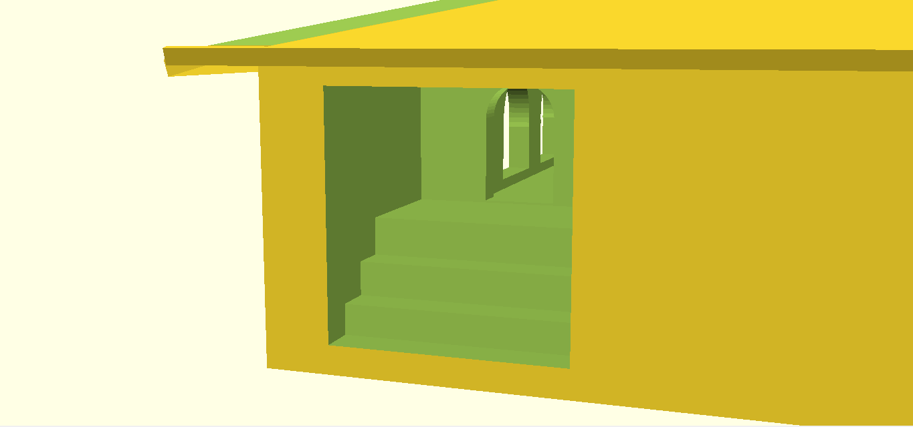

# Модель архитектурного строения 

## **Цель/Задание:**

- Создать модель архитектурного строения по своему выбору.

- Получить опыт работы с программами и языками программирования: `OpenSCAD`, `Git`, `Java`, `JavaSCAD` (небольшой `Java` фреймворк для генерирования моделей (https://www.printingin3d.eu/javascad)) (little model generator Java framework).

## **Инструментарий:**

- `OpenSCAD`;
- `Java`;
- `JavaSCAD`.
- После создания модели она импортировалась в `Blender`, где добавлялся свет и поверхность.

## Скриншоты из OpenSCAD:

# Architectural Model 

## **Objective / Task:**

- To create a model of the architectural building of your choice.

- To get experience working with programs and programming languages: `OpenSCAD`, `Git`, `Java`, `JavaSCAD` (a little model generator `Java` framework (https://www.printingin3d.eu/javascad)).

## **Tools:**

- `OpenSCAD`;
- `Java`;
- `JavaSCAD`.
- After creating the model, it was imported into `Blender` where light and surface were added.

## Screenshots from OpenSCAD:

